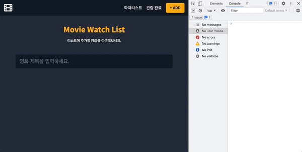
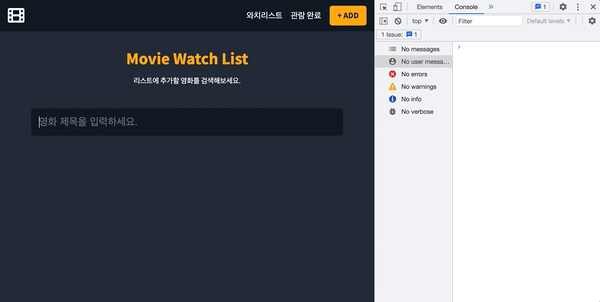

# Movie Watch List

📎 [Demo](https://nemo-movie-watch-list.herokuapp.com/)

<br/>


<br />

## Introduce
- 위시리스트처럼 영화의 와치리스트를 만들어 관리할 수 있는 애플리케이션입니다.
- 볼 영화 리스트(Watch list), 본 영화 리스트(Watched list)를 정리할 수 있습니다.
- Context를 사용하여 전역 데이터를 관리하였습니다.
- Watch list, Watched list 정보는 Local storage에 저장됩니다.
- API: [TMDB](https://www.themoviedb.org/?language=ko)

<br/>

## Development Environment
- Client: React, TypeScript, CSS

<br/>

## 최적화
- Context
- Lodash - Debounce 메서드로 검색 폼 최적화

### Before



<br />

### After



<br />

## Reference
📎 [Create a Movie Watchlist with React Hooks, Context API and localStorage](https://youtu.be/1eO_hNYzaSc)

<br/>


### 레퍼런스보다 개선된 사항
- useMemo를 사용하여 Context API로 인한 불필요한 리렌더링을 방지하였습니다. (최적화)
- TypeScript 환경에서 작업하였습니다.
- 한글로 검색이 가능합니다.
- 모바일에서 레이아웃이 틀어지지 않도록 수정하였습니다.
- 그 외 일부 CSS를 수정하였습니다.

<br/>


## Tree
```
movie-watchlist
├── public (정적 자원 관리)
│   ├── images
│   ├── index.html
│   └── robots.txt
├── src
│   ├── App.css
│   ├── App.tsx
│   ├── index.tsx
│   ├── Config.js
│   ├── components (컴포넌트 관리)
│   │   ├── Header.tsx (헤더)
│   │   ├── Add.tsx (영화 추가 페이지)
│   │   ├── Main.tsx (메인 페이지)
│   │   ├── Search.tsx (검색창 + 결과)
│   │   ├── ResultCard.tsx (검색 결과)
│   │   ├── Watchlist.tsx (와치리스트 페이지)
│   │   ├── Watched.tsx (관람 완료 페이지)
│   │   ├── MovieCard.tsx (와치리스트, 관람완료 페이지 영화 리스트)
│   │   ├── MovieControls.tsx (영화 리스트 삭제/이동 버튼)
│   │   └── NotFound.tsx (404 페이지)
│   ├── context (Context 관리)
│   │   ├── AppReducer.tsx (전역 상태에 대한 리듀서)
│   │   └── GlobalState.tsx (전역 상태 관리)
│   └── lib (라이브러리 관리)
│       └── font-awesome
├── README.md
├── package.json
├── package-lock.json
└── tsconfig.json
```

